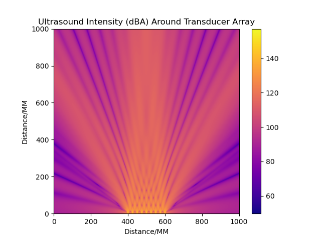

# Ultrasonic Sound Simulation #

### The Idea: ###

This started with a paper from the University of Chicago's SAND Lab: <https://sandlab.cs.uchicago.edu/jammer/>. The aim of their project was to create a wearable jammer that uses ultrasonic sound to jam many common microphones such as those used in Alexa or Google Home smart assistants.

I wanted to write a simulation which could replicate the simulation results achieved in their paper, as well as potentially be used for other ultrasound simulation tasks.

_More details about their project and simulation in their paper, written here: <https://people.cs.uchicago.edu/~ravenben/publications/pdf/ultra-chi20.pdf>_

### The Code: ###

This simulation is a fully vectorised (using NumPy) computation that computes a matrix of the wave from each transducer across the grid. These matrices are then summed together, before the resulting wave magnitude at each point is taken to determine the final simulation result. Results are log-scaled that to a decibel result - either dB or dBA, depending on the your preference.

The computation of the wave matrix from each transducer is run in parallel - one CPU core per transducer.

Any ideas to improve the simulation quality are welcome!

### Simulation Configuration: ###

In the SIM_CONFIG.py file are all the things that can be tuned to produce your simulation.

PLOTSIZE - The size of each side of the plot (in millimeters - to reduce simulation resolution requires a bit more code tweaking)

CPU_CORES - The maximum number of CPU cores the simulation will use when running

FREQUENCY - The sound frequency, in Hz, being simulated

TRANSDUCER_TRANSMITTING_PRESSURE_LEVEL - The volume of your transducer, in dB

R0 - The distance at which TRANSDUCER_TRANSMITTING_PRESSURE_LEVEL is measured, in meters

dBA - Whether or not the simulation output is in dB (dBA = False) or dBA (dBA = True)

TRANSDUCERS - An array describing your transducer setup. Each transducer should be formatted as: [[x-y position vector], [x-y central axis vector], phase offset (radians)]

User-defined function _userComputeBeamAngleResponse(angle_matrix)_:

This is where you can write your own function which the simulation will use to describe how the transducer's emitted sound amplitude varies with angle from the transducer central axis. Currently, this is a simple sinc() function approximation. When writing your own function here, ensure all the operations are NumPy matrix operations for efficiency and execution speed.
